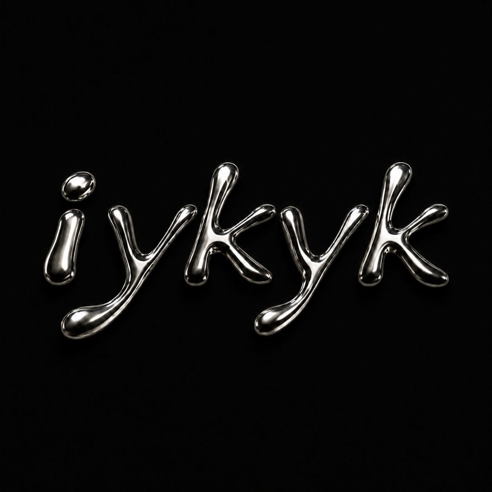
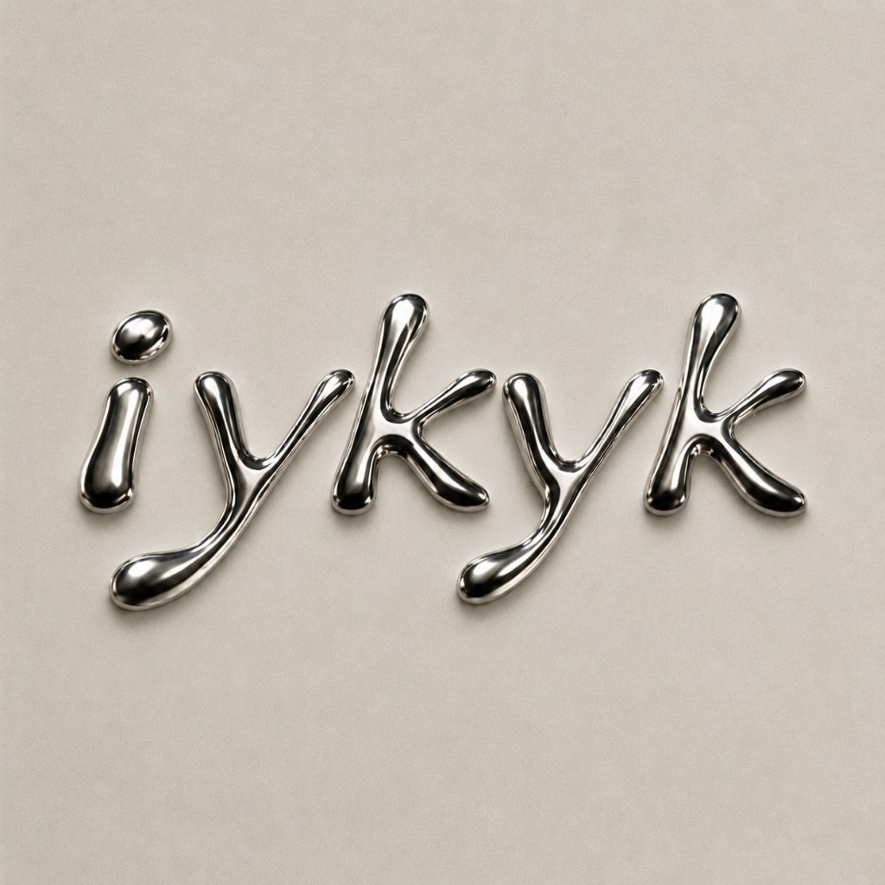
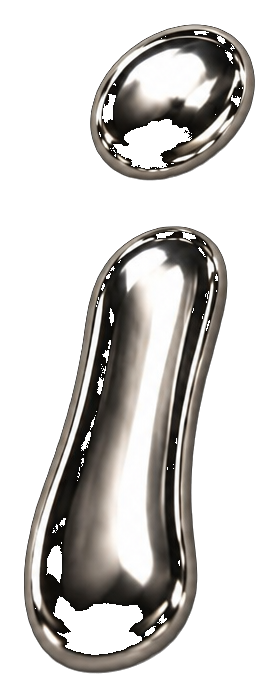
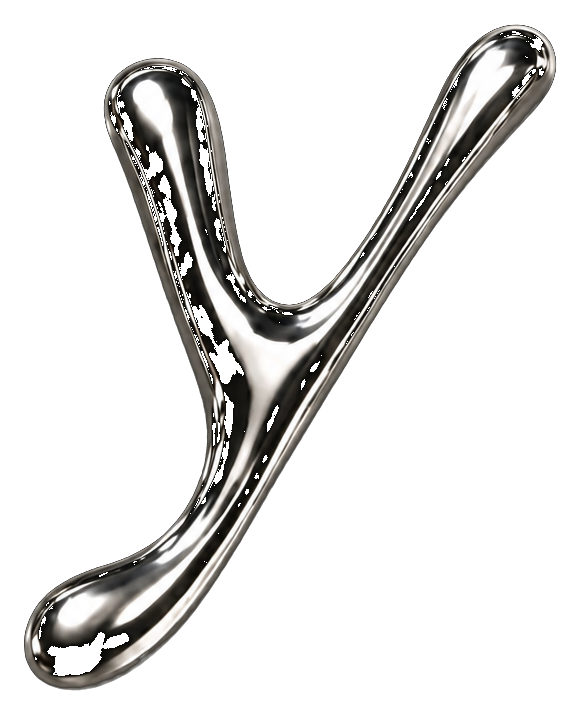

# Liquid Chrome

An open-source liquid-chrome lettering kit: glossy, molten-silver letterforms
inspired by 90s/Y2K chrome type. The look is captured in two complementary
ways so you can pick whatever fits your project:

1. **PNG glyphs** (`glyphs/png/`) — pre-rendered chrome letters `a-z` and
   `0-9` with transparent backgrounds. Pixel-perfect, works on any backdrop.
2. **Real font files** (`fonts/`) — installable `TTF` / `OTF` / `WOFF2` with
   blobby rounded outlines, plus a CSS metallic effect for the web.

| Reference (dark) | Reference (light) |
| --- | --- |
|  |  |

## Quick start

### Option A — PNG glyphs (pixel-perfect chrome)

Every character is a transparent PNG in `glyphs/png/` (`a.png` … `z.png`,
`0.png` … `9.png`). Compose words in any design tool, or use the bundled
composer:

```bash
# from the repo root
python3 -m http.server 8000
# open http://localhost:8000/demo/composer.html
```

Type a word, adjust size/spacing, toggle between black and cream backgrounds.

In plain HTML:

```html


```

(Descenders like `g j p q y f` need a negative bottom margin; see the metrics
table in `demo/composer.html`.)

### Option B — Install the font

Double-click `fonts/LiquidChrome-Regular.otf` (or `.ttf`) and press
"Install Font". The family is available as **Liquid Chrome**.

### Option C — Webfont + CSS chrome effect

```html
<link rel="stylesheet" href="css/liquid-chrome.css">

<h1 class="liquid-chrome">iykyk</h1>                          <!-- dark bg -->
<h1 class="liquid-chrome liquid-chrome--light">iykyk</h1>     <!-- light bg -->
<h1 class="liquid-chrome liquid-chrome--animated">iykyk</h1>  <!-- shine sweep -->
```

The CSS applies a multi-stop silver gradient via `background-clip: text`.
It is an approximation of the rendered chrome — for the exact look of the
reference images use the PNG glyphs.

See both variants side by side: `demo/index.html`.

## Building it yourself

```bash
python3 -m venv .venv && .venv/bin/pip install -r requirements.txt

# 1. Regenerate transparent glyphs from raw renders (glyphs/raw/)
.venv/bin/python scripts/make_transparent.py

# 2. Rebuild the font files (downloads Comfortaa as the base skeleton)
curl -sL -o "build/Comfortaa[wght].ttf" \
  "https://github.com/google/fonts/raw/main/ofl/comfortaa/Comfortaa%5Bwght%5D.ttf"
.venv/bin/python scripts/build_font.py
```

`scripts/build_font.py` pins Comfortaa Bold, subsets it to Latin, then grows
every outline with a round-join stroke (skia-pathops) and merges it back into
the fill — corners and joints melt into the organic droplet look. Exports
TTF, OTF and WOFF2.

## Repository layout

```
fonts/            LiquidChrome-Regular.ttf / .otf / .woff2
glyphs/png/       transparent chrome letters (a-z, 0-9)
glyphs/raw/       original AI renders on black (build input)
css/              @font-face + metallic gradient effect
demo/             index.html (overview), composer.html (word builder)
scripts/          make_transparent.py, build_font.py
reference/        the two original reference images
```

## Licensing

- **Font files** (`fonts/`, `scripts/build_font.py` output): licensed under
  the [SIL Open Font License 1.1](LICENSE). Derived from
  [Comfortaa](https://github.com/googlefonts/comfortaa), Copyright 2011 The
  Comfortaa Project Authors. "Comfortaa" is a Reserved Font Name and is not
  used by this project.
- **PNG glyphs and reference images** (`glyphs/`, `reference/`): licensed
  under [CC BY 4.0](https://creativecommons.org/licenses/by/4.0/) — use them
  anywhere, credit "Liquid Chrome contributors".
- **Code** (`scripts/`, `demo/`, `css/`): MIT, do what you want.
